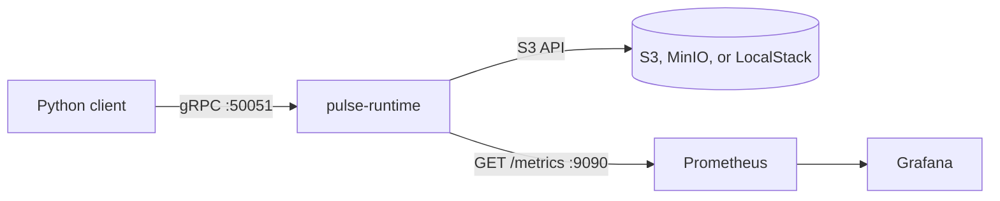

# PulseCheckpoint Runtime

[](https://github.com/lloredia/pulsecheckpoint-runtime/actions/workflows/ci.yml)
[](LICENSE)

A single-process gRPC service that stores checkpoint bytes in S3-compatible object storage. Worker, dataset, and checkpoint records stay in memory. Prometheus scrapes a small HTTP endpoint, and a Grafana dashboard is provisioned for local runs.

This is a portfolio service, not a multi-node control plane. Restarting the process forgets every registration even when the objects are still in the bucket. List calls page through that in-memory set. The gRPC listener does not terminate TLS.

## Architecture



The process is one Tokio binary:

- `tonic` serves `pulse.v1.PulseService`
- a `Storage` trait writes bytes; the shipping backend is the AWS SDK for S3
- credentials come from the SDK default chain (environment, shared config, or an instance role)
- set `PULSE_S3_ENDPOINT` for MinIO or LocalStack; leave it unset to use the regional AWS endpoint
- path-style addressing is on by default when a custom endpoint is set

## What is implemented

- Register, heartbeat, list, and deregister workers. Heartbeats that go quiet are marked unhealthy.
- Register and list dataset names and paths. The bytes of a dataset are not ingested.
- Save, get, list, and delete checkpoints. Saves retry with backoff. An idempotency key returns the first completed checkpoint.
- Unary and client-streaming uploads. Downloads are unary.
- SHA-256 is stored and checked on read.
- `/metrics`, `/health`, and `/ready` on the metrics port.
- Unit tests use in-memory and filesystem storage. `cargo test` also runs a gRPC round trip when `PULSE_S3_ENDPOINT` is set.

## Quick start

Requires Rust stable, a protobuf compiler, Docker, and Python 3.10+ if you want the example.

```bash
cp .env.example .env
# edit the local MinIO and Grafana passwords; do not add AWS account keys
docker compose up -d --build
```

| Port | Process |
| --- | --- |
| 50051 | gRPC |
| 9090 | runtime metrics |
| 9000 | MinIO API |
| 9001 | MinIO console |
| 9091 | Prometheus |
| 3000 | Grafana, with the provisioned PulseCheckpoint dashboard |

To run the binary on the host instead of in Compose, point it at MinIO with the credential chain:

```bash
export PULSE_S3_ENDPOINT=http://127.0.0.1:9000
export PULSE_S3_BUCKET=checkpoints
export PULSE_S3_REGION=us-east-1
export PULSE_S3_FORCE_PATH_STYLE=true
export AWS_ACCESS_KEY_ID="$MINIO_ROOT_USER"
export AWS_SECRET_ACCESS_KEY="$MINIO_ROOT_PASSWORD"
export AWS_EC2_METADATA_DISABLED=true
cargo run --manifest-path runtime/Cargo.toml
```

`config.toml.example` is the file form of the same settings. Pass `--config`.

### Python example

Committed stubs live in `sdk/pulse/generated`. Regenerate them after proto changes:

```bash
python3 -m pip install grpcio protobuf grpcio-tools
make generate-proto
PYTHONPATH=sdk python3 examples/basic_usage.py
```

`make run-example` does the same. The script exits non-zero if a call fails.

## gRPC API

Package `pulse.v1`, service `PulseService`. The source of truth is [`proto/pulse.proto`](proto/pulse.proto).

| RPC | Behavior |
| --- | --- |
| `RegisterWorker` | Remembers a worker id and labels. Empty ids and ids containing `/` or `..` are rejected. |
| `DeregisterWorker` | Drops the worker from this process. |
| `Heartbeat` | Refreshes `last_heartbeat`. Status `UNSPECIFIED` leaves the current status alone. |
| `ListWorkers` | Filters by status. `page_size` 0 means 100, capped at 1000. `page_token` is a decimal offset. |
| `RegisterDataset` | Stores an id and a path string. |
| `ListDatasets` | Same paging rules as workers. |
| `SaveCheckpoint` | Requires a registered worker and non-empty bytes. Optional `idempotency_key`. |
| `SaveCheckpointStream` | One header, then chunks. `total_size` must match the bytes when it is set. |
| `GetCheckpoint` | Returns metadata. `include_data` also returns the bytes after a checksum check. |
| `ListCheckpoints` | Optional worker and status filters, same paging rules. |
| `DeleteCheckpoint` | Removes the index entry and the object. |
| `HealthCheck` | Reports process version, uptime, and whether `HeadBucket` succeeded. |

Server reflection is enabled.

## Metrics

Scraped at `http://<metrics>/metrics`.

| Metric | Type | Labels |
| --- | --- | --- |
| `pulse_checkpoints_total` | counter | |
| `pulse_checkpoint_bytes_total` | counter | |
| `pulse_checkpoint_duration_seconds` | histogram | |
| `pulse_active_workers` | gauge | |
| `pulse_worker_registrations_total` | counter | |
| `pulse_worker_heartbeats_total` | counter | |
| `pulse_s3_requests_total` | counter | `operation`, `status` |
| `pulse_s3_request_duration_seconds` | histogram | `operation` |
| `pulse_grpc_requests_total` | counter | `method`, `status` |
| `pulse_grpc_request_duration_seconds` | histogram | `method` |
| `pulse_datasets_total` | gauge | |
| `pulse_errors_total` | counter | `error_type` |

The Grafana dashboard in `observability/grafana/dashboards/pulse-runtime.json` graphs those series. Prometheus is configured in `observability/prometheus/prometheus.yml`.

## Configuration

| Variable | Role | Default |
| --- | --- | --- |
| `PULSE_GRPC_ADDR` | Listen address | `0.0.0.0:50051` |
| `PULSE_METRICS_ADDR` | Metrics listen address | `0.0.0.0:9090` |
| `PULSE_S3_ENDPOINT` | Custom S3 endpoint. Empty uses AWS. | unset |
| `PULSE_S3_BUCKET` | Bucket name | `checkpoints` |
| `PULSE_S3_REGION` | Region | `us-east-1` |
| `PULSE_S3_FORCE_PATH_STYLE` | Path-style URLs for a custom endpoint | `true` |
| `PULSE_S3_PATH_PREFIX` | Key prefix inside the bucket | unset |
| `PULSE_MAX_RETRIES` | Upload attempts | `3` |
| `PULSE_RETRY_DELAY_MS` | First retry delay | `100` |
| `PULSE_HEARTBEAT_TIMEOUT_SECS` | Time before a worker is marked unhealthy | `90` |
| `PULSE_LOG_LEVEL` | Tracing filter | `info` |

Do not put AWS access keys in config files. For MinIO or LocalStack, export the usual `AWS_ACCESS_KEY_ID` and `AWS_SECRET_ACCESS_KEY` so the default chain can see them. On EC2 or ECS, an instance or task role is enough when no custom endpoint is set.

## Tests and images

```bash
cargo fmt --manifest-path runtime/Cargo.toml --all -- --check
cargo clippy --manifest-path runtime/Cargo.toml --all-targets --all-features -- -D warnings
cargo test --manifest-path runtime/Cargo.toml --all-targets
```

The S3 integration test skips unless `PULSE_S3_ENDPOINT` is set. CI starts MinIO and sets it. `CI=true` without that variable fails the test.

`docker/Dockerfile` is a multi-stage build. The runtime image is distroless and runs as the nonroot user. `docker compose` also builds MinIO from the pinned upstream source in `docker/minio.Dockerfile`, because community MinIO container tags are no longer published.

`terraform/` is an unfinished dev sketch. It is not planned or applied by CI.

## Roadmap

- Persist the worker, dataset, and checkpoint index so a restart can see existing objects.
- TLS on the gRPC listener.
- Streaming download and multipart upload for large checkpoints.
- More than one runtime replica.
- A real pagination cursor, not an offset into an in-memory vec.

## License

MIT. See [LICENSE](LICENSE).
